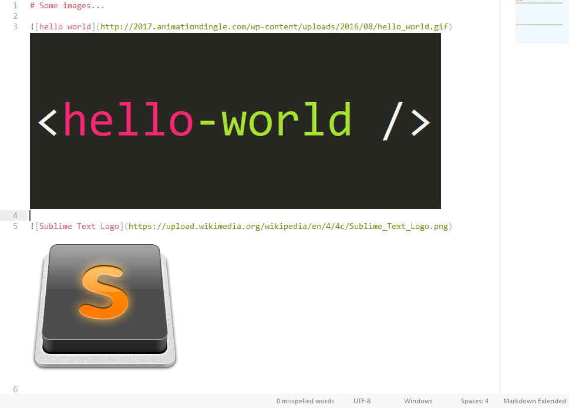
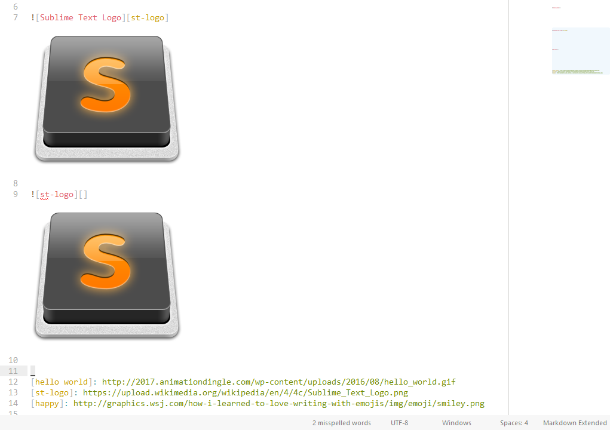
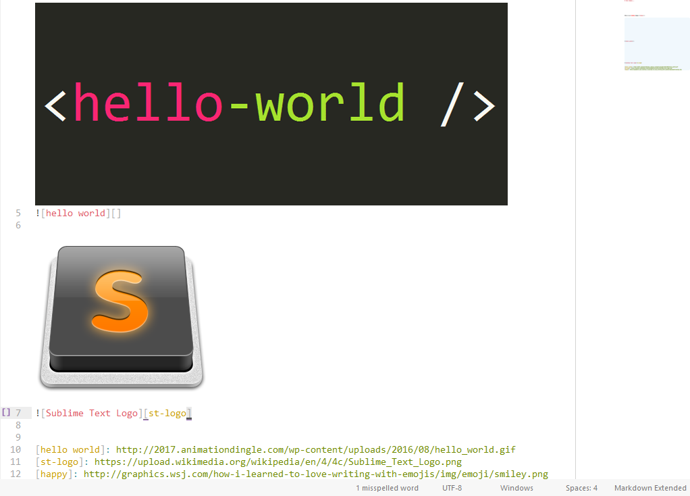

# MarkdownInlineImages

MarkdownInlineImages is a plugin that renders your images below their link. Why? Because markdown
is just great, except for images. Reading a markdown file is really easy, almost as easy as a it can
be once it's converted to HTML for example, if you have a good color scheme. Except for images. This
plugin just completes this gap :smile:

So, to use it, just press <kbd>alt+i</kbd>, or, from the command palette, select
`MarkdownInlineImages: Render Images`. All the images will rendered.

#### The *actual* behaviour

When you press <kbd>alt+i</kbd>, the image are rendered, *except* if you haven't made **any** change
to the buffer, it'll hide all of them. So, if you want to hide the images, just press twice
<kbd>alt+i</kbd>.

## Which type of image for it work with?

You can use images loaded from internet, or relative to your *file*. The support formats are:

- `PNG`
- `BMP`
- `JPG`
- `GIF`

**Note**: *Every* images rendered is cached in a single file. Even the local ones (because they are
converted to `base64`)

## Can I use references?

Yes, you can!

## Hum... The link goes usualy below the image, no?

This is a personal preference... But, I added a settings so that it fits *your* need (stop looking
behind you, I'm talking to *you* :stuck_out_tongue_winking_eye:)

Open up your settings:

- from the command palette (<kbd>ctrl+shift+p</kbd>) and search for
`Preferences: MarkdownInlineImages Settings`
- from the menus: *Preferences → Package Settings → MarkdownInlineImages*

And set the setting `display_image_above_markup` to `true`. Here's what you'll get:

